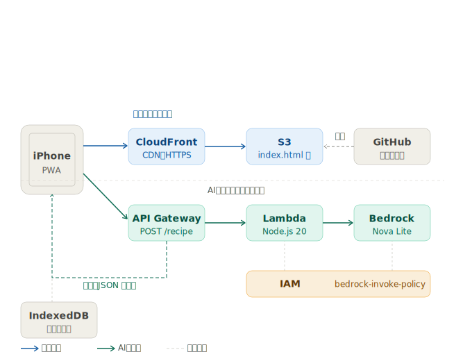

# 🍳 レシピ帳アプリ
URLを貼るだけでレシピを自動取得・保存できるiPhone対応Webアプリです。

## 機能
- URLを貼るだけでAIがレシピを自動取得
- 材料・手順・写真を保存
- 食材からレシピを検索
- お気に入り機能
- iPhoneのホーム画面からアプリとして起動可能（PWA）
- データはIndexedDBに保存（容量無制限）

## 使用技術
- フロントエンド：HTML / CSS / JavaScript
- バックエンド：AWS Lambda（Node.js 20）
- AI：Amazon Bedrock（Claude Haiku 4.5）
- インフラ：AWS S3 + CloudFront + API Gateway
- データ保存：IndexedDB（端末内・サーバー不要）

## アーキテクチャ
iPhone → CloudFront → S3（index.html）
iPhone → API Gateway → Lambda → Bedrock（Claude）

## デモ
https://ddios7th80zic.cloudfront.net
